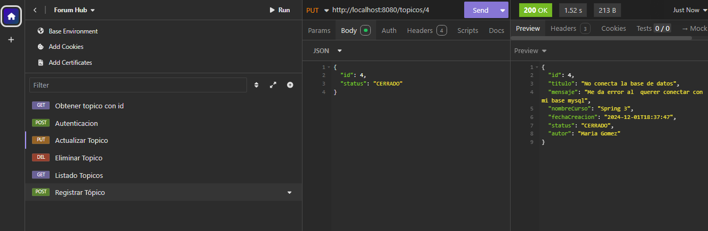

# Foro Hub

Foro Hub es una API REST desarrollada en **Java** utilizando el framework **Spring Boot**. 
Esta API permite a los usuarios gestionar tópicos mediante las operaciones básicas de CRUD (Crear, Leer, Actualizar y Eliminar). 
Además, implementa seguridad con **Spring Security** y **JWT** para la autenticación y autorización de usuarios, así como manejo avanzado de errores para garantizar una experiencia de usuario robusta.

---

## Tecnologías Utilizadas

- **Java**: Versión 17 en adelante
- **Spring Boot**: Versión 3 en adelante
- **Maven**: Versión 4 en adelante
- **Spring Security**
- **JWT** (JSON Web Tokens)
- **MySQL**: Versión 8 en adelante
- **Flyway**: Para migraciones de base de datos
- **Lombok**: Para reducir el código boilerplate
- **IntelliJ IDEA** (opcional, como IDE recomendado)
- **Insomnia**: Para realizar pruebas de las rutas de la API

---

## Dependencias Principales

Las siguientes dependencias fueron configuradas en el archivo `pom.xml` al crear el proyecto con Spring Initializr:

- **Spring Web**: Para la construcción de APIs REST.
- **Spring Boot DevTools**: Para el desarrollo rápido con recarga automática de cambios.
- **Spring Data JPA**: Para el acceso y gestión de datos con JPA/Hibernate.
- **Flyway Migration**: Para gestionar la evolución de la base de datos.
- **MySQL Driver**: Para conectarse a la base de datos MySQL.
- **Validation**: Para realizar validaciones de datos.
- **Spring Security**: Para manejar autenticación y autorización.
- **Lombok**: Para simplificar el código eliminando getters, setters y constructores repetitivos.

---

## Funcionalidades de la API

La API proporciona las siguientes funcionalidades:

### Tópicos
1. **Crear un nuevo tópico**
2. **Mostrar todos los tópicos creados**
3. **Mostrar un tópico específico**
4. **Actualizar un tópico**
5. **Eliminar un tópico**

### Seguridad
- Autenticación con JWT (JSON Web Tokens).
- Restricción de acceso a las rutas mediante Spring Security.

### Manejo de Errores
- Mensajes claros y específicos si faltan datos para crear un tópico.
- Validación para evitar duplicados de título y mensaje.
- Mensajes personalizados si un tópico no se encuentra por ID o si se intenta eliminar un tópico inexistente.

---

## Configuración del Entorno

### Requisitos Previos

1. **Java JDK**: Descarga e instala la versión 17 o superior desde [Oracle](https://www.oracle.com/java/technologies/javase-downloads.html).
2. **Maven**: Asegúrate de tener Maven 4 o superior instalado.
3. **MySQL**: Instala la versión 8 o superior y configura una base de datos para la aplicación.
4. **IDE**: Se recomienda **IntelliJ IDEA**, aunque puedes usar cualquier IDE compatible con Java.
5. **Spring Initializr**: Crea el proyecto desde [start.spring.io](https://start.spring.io/) con las dependencias mencionadas anteriormente.

### Configuración de Variables de Entorno

1. **JWT Secret**:
    - Crea una variable de entorno `JWT_SECRET_KEY`.
    - En el archivo `application.properties`, configura:
      ```properties
      api.security.secret=${JWT_SECRET_KEY}
      ```

2. **Contraseña de MySQL**:
    - Crea una variable de entorno `DB_PASSWORD_KEY`.
    - En el archivo `application.properties`, configura:
      ```properties
      spring.datasource.password=${DB_PASSWORD_KEY}
      ```

---

## Estructura del Proyecto

La organización del código sigue una arquitectura limpia y modular:

- **Paquete `controller`**: Contiene los controladores REST que gestionan las solicitudes HTTP.
- **Clase   `repository`**: Gestiona el acceso a la base de datos mediante JPA.
- **Paquete `domain`**: Dentro los paquetes: Topicos y Usuarios: 
- Incluye las entidades del dominio y sus DTOs que manejan los objetos de transferencia de datos.
- **Paquete `errores`**: Contiene las clases para el manejo de errores y excepciones personalizadas.
- **Paquete `security`**: Implementa la configuración de seguridad, autenticación y generación de JWT.

---

## Uso de la API

### Endpoints Principales

- **POST** `http://localhost:8080/topicos` - Crear un nuevo tópico.
  


- **GET** `http://localhost:8080/topicos` - Mostrar todos los tópicos.
  


- **GET** `http://localhost:8080/topicos/{id}` - Mostrar un tópico específico por ID.


- **PUT** `http://localhost:8080/topicos/{id}` - Actualizar un tópico por ID.



- **DELETE** `http://localhost:8080/topicos/{id}` - Eliminar un tópico por ID.


### Autenticación
- **POST** `http://localhost:8080/login` - Genera un token JWT para autenticar las solicitudes posteriores.

#### Requisitos Previos
Para que el proceso de autenticación funcione correctamente, asegúrate de que:

1. **Usuario y Contraseña**:
    - Se haya creado previamente un usuario en la tabla `usuarios` de la base de datos.
    - La contraseña debe estar almacenada de forma segura utilizando el algoritmo de hash **bcrypt**.
    - Ejemplo: Puedes crear un usuario manualmente con una herramienta como **MySQL Workbench**, o hacerlo mediante un script en tu aplicación backend que use bcrypt para encriptar la contraseña.


Ejemplo de solicitud de autenticación en insomnia:
```json
{
    "login": "usuario",
    "clave": "contraseña"
}
```
Respuesta esperada:
Si las credenciales son válidas, la API devolverá un token JWT que puedes usar para autenticar las solicitudes posteriores:

```json
{
"jwTtoken": "eyJhbGciOiJIUzI1NiIsInR5cCI6IkpXVCJ9..."
}
```

   **Token Generado**


---

## Manejo de Errores

El sistema está diseñado para manejar errores comunes y devolver mensajes claros:

1. **Faltan datos para crear un tópico**: Devuelve un mensaje indicando los campos faltantes.


2. **Título y mensaje duplicados**: Evita la creación de tópicos con información repetida.


3. **Tópico no encontrado**: Mensaje personalizado si el ID buscado no existe.


4. **Eliminación de un tópico inexistente**: Indica que no es posible eliminar un recurso no existente.


## Video de su implementación y funcionamiento: https://www.youtube.com/watch?v=--cU4E-qKQ0

## Autora

Este proyecto fue desarrollado por Noelia Orsini para Alura Latam
